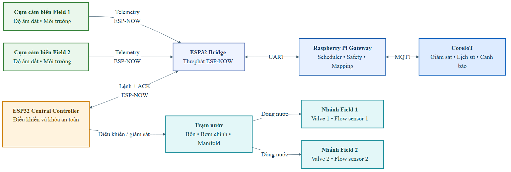

# Smart Irrigation on CoreIoT with Raspberry Pi

Đồ án xây dựng hệ thống Smart Farm đa vùng, lấy **Smart Irrigation Template** làm
hợp đồng dữ liệu lõi, sử dụng **Raspberry Pi** làm gateway điều khiển biên,
**ESP32/ESP-NOW** cho mạng cảm biến và **CoreIoT** cho telemetry, cấu hình, lịch
sử, dashboard và cảnh báo.



## Mục tiêu chính

- Thu thập dữ liệu độ ẩm đất và môi trường theo từng vùng tưới.
- Điều khiển van và bơm với cơ chế phân quyền, xác nhận lệnh và giới hạn an toàn.
- Duy trì lịch tưới và hard-safety tại gateway khi mất kết nối cloud.
- Đồng bộ telemetry, trạng thái, cấu hình và cảnh báo với CoreIoT.
- Lưu evidence có thể truy vết, phân biệt rõ mô phỏng, platform và HIL.

## Kiến trúc

```text
Sensor nodes (ESP32)
        │ ESP-NOW
        ▼
ESP32 Bridge ── UART/USB ── Raspberry Pi Gateway ── MQTT ── CoreIoT
        │                         │
        └── Central/Manifold ◄────┘
              valve + pump
```

Gateway là thành phần do sinh viên xây dựng, không phải ThingsBoard/CoreIoT
Edge. Gateway giữ quyền quyết định cuối cùng đối với scheduler, arbitration,
safety, actuator state/ACK và degraded replay; CoreIoT đảm nhiệm lớp platform.

## Thành phần trong repository

| Thư mục | Nội dung |
|---|---|
| [`docs/final`](docs/final/README.md) | SRS, thiết kế hệ thống và knowledge base đã chốt |
| [`docs/audits`](docs/audits/CoreIoT_SRS_Design_Crosscheck.md) | Cross-check và traceability kỹ thuật |
| [`implementation/gateway`](implementation/gateway/README.md) | Gateway Python, scheduler, safety và CoreIoT Gateway API |
| [`implementation/coreiot`](implementation/coreiot/README.md) | Profile, rule chain, manifest và script sinh/kiểm tra artifact |
| [`implementation/firmware`](implementation/firmware/README.md) | Firmware ESP32 và chương trình chẩn đoán/HIL |
| [`tests`](tests/README.md) | Unit test và regression/static checks |
| [`evidence`](evidence/README.md) | Evidence theo `run_id` và mức kiểm chứng |

## Phạm vi đã kiểm chứng

| Hạng mục | Mức evidence | Giới hạn diễn giải |
|---|---|---|
| CoreIoT telemetry và vertical slice ban đầu | `SIM+PLATFORM` | Có platform thật, dữ liệu/actuator mô phỏng |
| Gateway v2.3 hai Field, scheduler và hard-safety | `local-tested` / `live-observed` | Không đồng nghĩa phần cứng tưới hoàn chỉnh |
| Alarm, degraded/reconnect và schedule | `live-verified` theo từng bundle | Chỉ khẳng định đúng originator và kịch bản đã ghi nhận |
| ESP32-S3 ESP-NOW và runtime ba board | `HIL` | Output LED/GPIO và ACK, chưa phải van/bơm cơ khí |

Repository **không tuyên bố đã hoàn tất bằng chứng `PHY`** cho toàn bộ hệ tưới.
Mỗi bundle trong `evidence/runs/` ghi rõ thành phần thật, thành phần mô phỏng và
kết quả quan sát.

## Chạy kiểm thử cục bộ

Yêu cầu Python 3. Các lệnh không cần credential CoreIoT:

```powershell
python -m unittest discover -s tests/unit -v
python -m unittest discover -s tests/regression -v
python implementation/gateway/simulator_v23.py `
  --config implementation/gateway/config/devices.v23.example.json `
  --offline --ticks 40 --interval 0
```

Firmware HIL sử dụng PlatformIO; xem hướng dẫn tại
[`implementation/firmware/smartfarm_hil_v1`](implementation/firmware/smartfarm_hil_v1/README.md).

## Tài liệu nền chính thức

1. [SRS v2.2](docs/final/requirements/SRS_v2.2.md)
2. [Thiết kế hệ thống v2.2](docs/final/system_design/RB%20Thiet_ke_he_thong_v2.2_SmartFarm_an_toan_rebuild.docx)
3. [CoreIoT Smart Irrigation Knowledge Base](docs/final/research/CoreIoT_Smart_Irrigation_Knowledge_Base.md)

## Bảo mật và tái lập

Credential được đọc từ biến môi trường. Repository không lưu `.env`, access
token, credential gateway, build cache, firmware backup hoặc trạng thái runtime.
Các file `*.example.*` chỉ cung cấp cấu hình mẫu.

## Ghi chú bản quyền

Đây là repository phục vụ đồ án tốt nghiệp. Chưa cấp giấy phép mã nguồn mở;
mọi quyền được bảo lưu nếu không có thỏa thuận khác.
